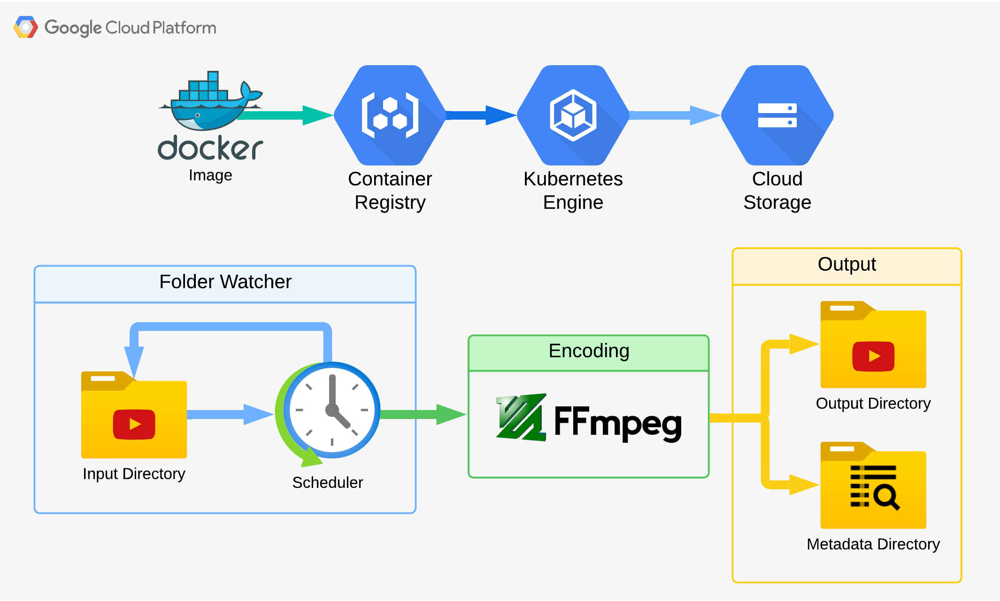

# Automated Video Conversion and Encoding

This project provides An automated Kubernetes-based video conversion solution leveraging GCS storage, with watch folder functionality for automated processing.

## Description
This project provides an automated solution for video conversion and encoding. It is designed to run on Kubernetes, leveraging Google Cloud Storage (GCS) for managing input and output files. The pipeline includes an automated scheduling mechanism to process videos at regular intervals, functioning like a watch folder system - automatically detecting and processing new video files added to the input directory. The system runs daily, processing multiple videos in parallel across Kubernetes pods.

------------------------------------------------------------------------------------



## Features
- Converts videos to `H.265` codec for high compression and quality, cutting file sized by half by reducing bitrate.
- Fetches the latest input video files from a specified GCS bucket directory.
- Uploads/export processed video files to an output directory in the same GCS bucket.
- Maintains metadata of processed files to avoid reprocessing.
- Runs as a Kubernetes job for scalable and isolated video processing tasks, and utilize parallel processing.
- Automated scheduling through Kubernetes CronJob (24-hours interval).

## Prerequisites
- FFmpeg Pre-installed in the Docker container for video processing.
- Docker installed for building container images.
- A GCS bucket for input and output files.
- Service account with appropriate permissions (`roles/storage.objectAdmin` for example) / Service account json credentials file.
- A Kubernetes cluster to deploy the job.
- A Google Artifact Registry to store and manage the container image.

## Setup and Deployment

### 1. Clone the Repository

```bash
git clone <repository-url>
cd <repository-folder>
```

### 2. Configure Environment Variables

Set the following environment variables:
```bash
BUCKET_NAME: Name of the GCS bucket.
INPUT_PREFIX: Input directory in the GCS bucket.
OUTPUT_PREFIX: Output directory in the GCS bucket.
METADATA_PREFIX: Metadata directory in the GCS bucket
```

### 3. Build and Push Docker Image
```bash
./build_and_push.sh
```
  
### 4. Deploy on Kubernetes

Modify the job.yaml file to include your Docker image and environment variables.  
Deploy the job using kubectl:
```bash
kubectl apply -f job.yaml
```
or

```bash
kubectl apply -f cronejob.yaml
```
